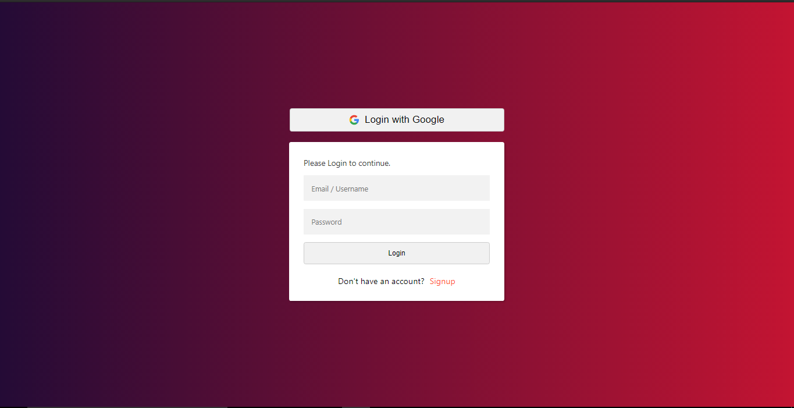
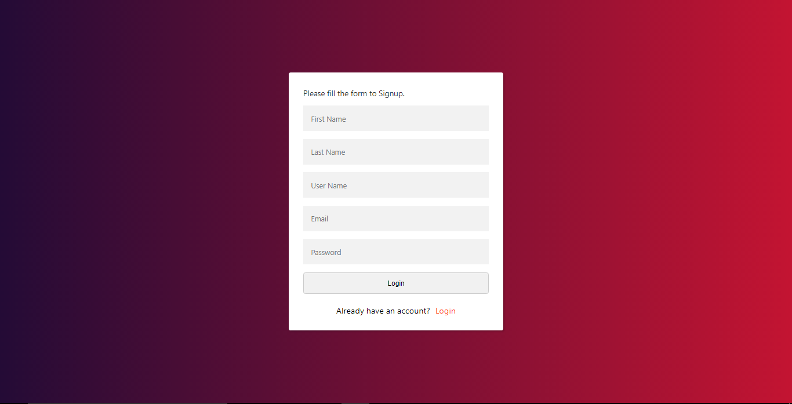
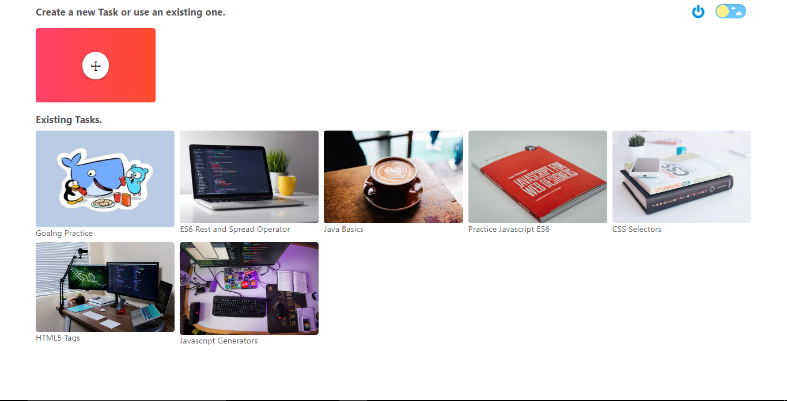
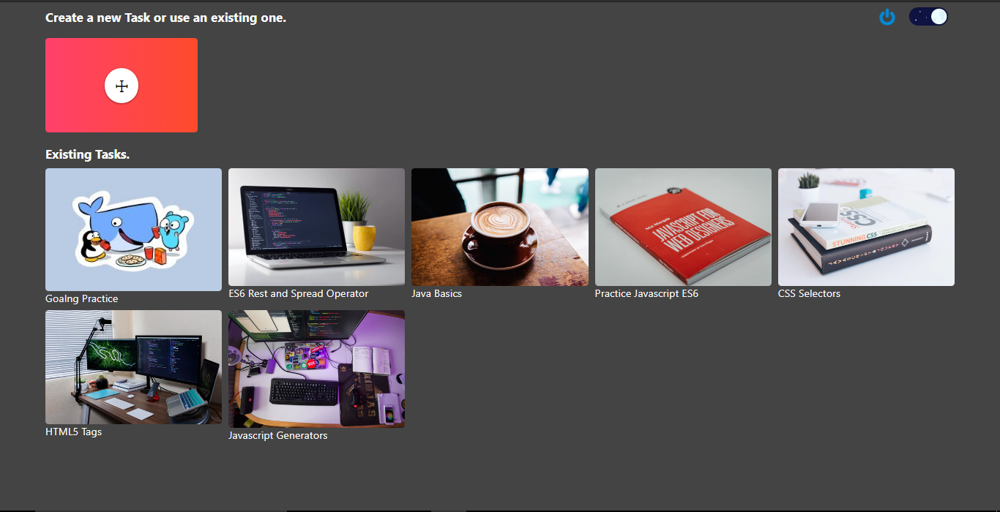
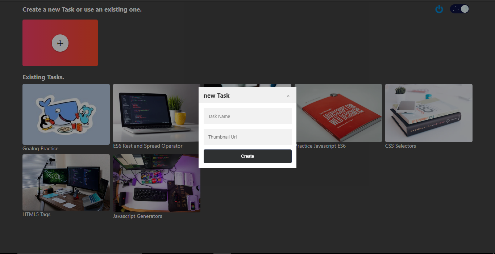
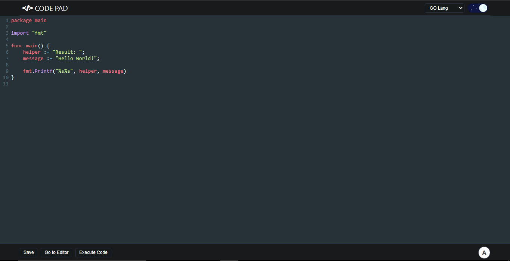
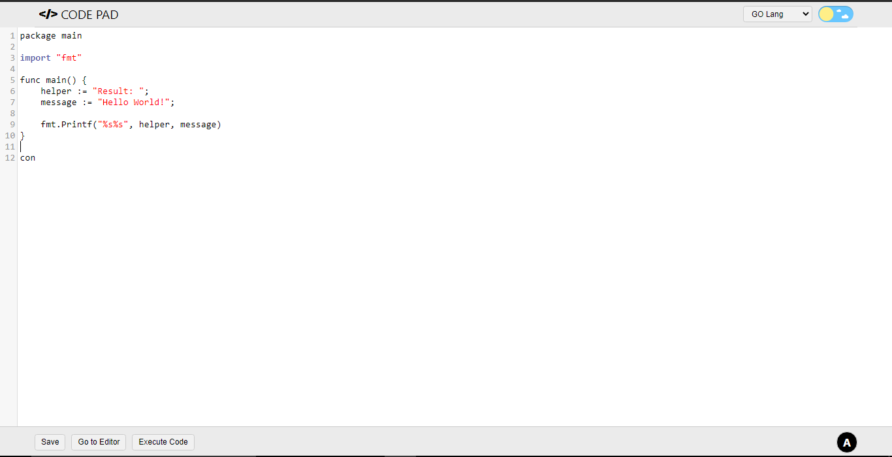
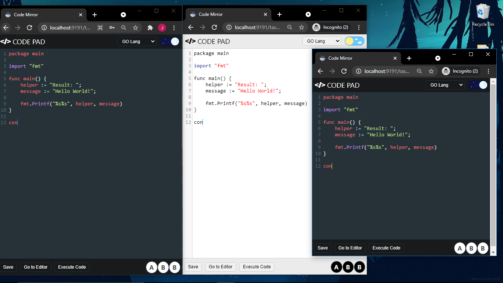
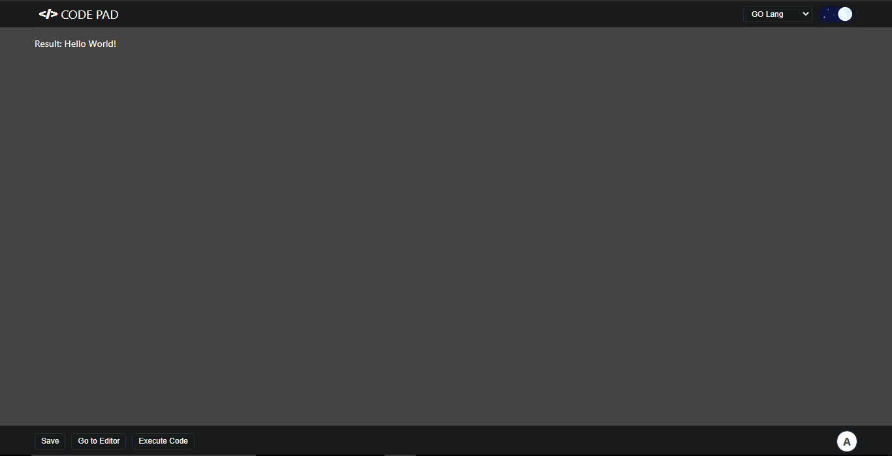

# CodePad

Collaborative Code Editor build with Nodejs, Mongodb, Expressjs, Reactjs, Socketio &
Typescript.

## Setting up

### Install server and client dependencies

In order to install client and server dependencies run the following command in the root
of the project directory.

```
$ npm run install
```

## Starting Development

before doing anything first makes sure to setup necessory environment variables. the
client's environment variables can be found out by looking at **client/.env** whereas the
server environment variable information is placed in **server/config/env.ts** file.

### Start client in development mode

first make sure you are in the root of the project and run the following command.

```
$ npm run client:dev
```

### For starting server in development mode

run the following command in the root of the project directory.

```
$ npm run server:dev
```

## Production Build

For making a production build for server and client run the following command in the root
of the project directory

```
$ npm run build
```

this would create a new **build** folder in the root project directory with both client
and server builds.

# Project Screenshots



















## client folder structure

```
build
node_modules
public
src
    components
        auth-forms
            elements.ts
            login-form.tsx
            signup-form.tsx
        code-editor
            index.tsx
        display-results
            index.tsx
        editing-area
            index.tsx
        editor-header
            elements.ts
            index.tsx
        elements
            button.tsx
            google-icon-button.tsx
            h2.tsx
            h3.tsx
            index.tsx
            input.tsx
            loader.tsx
            wrapper.tsx
            modifiers
                button.ts
                h2.ts
                margin.ts
                padding.ts
        main-task
            elements.ts
            new-task.tsx
            task-list.tsx
            task-modal.tsx
            task.tsx
        not-found
            elements.ts
            index.tsx
        routes
            index.tsx
        index.tsx
    pages
        index.tsx
        main.tsx
        Oauth2.tsx
        task.tsx
    store
        authContext.tsx
        themeContext.tsx
    utils
        add-remote-cursor.ts
        breakpoints.ts
        constants.ts
        global-styles.ts
        handleMultiUserEditing.ts
        language-data.ts
        socket.ts
        theme.ts
        api
            auth.ts
            compile.ts
            httpService.ts
            Oauth2.ts
            task.ts
    App.tsx
    index.tsx
    react-app-env.d.ts
.env
.gitignore
package-lock.json
package.json
tsconfig.json
```

## server folder structure

```
build
node_modults
src
    config
        constants.ts
        db.ts
        env.ts
    middlewares
        auth-checket.ts
        error-handler.ts
    route_handlers
        compile.ts
        Oauth2.ts
        task.ts
        user.ts
    routes
        compile.ts
        index.ts
        Oauth2.ts
        task.ts
        user.ts
    schema
        Task.ts
        User.ts
    utils
        error.ts
        hasher.ts
        tokenizer.ts
    validators
        compile.ts
        task.ts
        user.ts
    index.ts
    server.ts
    socket.ts
.eslintrc
.gitignore
package.json
package-lock.json
tsconfig.json
```

# License

MIT
